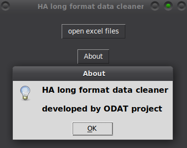

# Tool 1

This GUI-based application streamlines the cleaning and reformatting of raw, long-format Hospital Authority (HA) Hong Kong medical data into standardized CSV and XLSX output.

## Description

[Visit odat.info](https://odat.info)

## Screenshot

